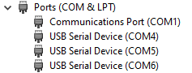

# SlimeTora (GX6 only fork)
## **This fork includes basic support for the GX6 dongle. The program is now in a more stable state, however still expect bugs!**

A program that connects the HaritoraX Wireless trackers to the [SlimeVR server](https://docs.slimevr.dev/server/index.html), supporting the GX6 communication dongle

This fork adds support for the GX6 communication dongle, opening up the software to everyone! **Bluetooth support has been removed from this fork, if that's needed use the original repo.**

## A rewrite of SlimeTora is in the works which will improve stability and performance *massively*.

# Known issues
- ~~Connecting is very finicky (e.g. trackers connect on SlimeTora but not show in SlimeVR)~~
  - ~~Usually fixed by restarting the trackers or reconnecting the GX6 dongle~~
  - **Fixed with v0.2.1**
- ~~Trackers may not be assigned correctly in SlimeTora~~
  - ~~Not too much of a problem as you can identify the actual tracker by shaking it~~
  - **Fixed with v0.2.1**
- ~~Higher CPU usage~~
  - **Temporarily mediated with this fork by removing the tracker visualization code, will be fixed in rewrite and given option to toggle it**
- UI incomplete
  - Yeah, very quick implementation of the stuff which you can tell. Rewrite will improve everything lol
- `node_modules` and well.. the entire source code comes with the app instead of being bundled and compiled
  - Rewrite will use webpack and other tools to prevent this
- COM ports not saved on restart
- Tapping on trackers aren't detected (for gesture resets) in SlimeVR
- ~~Battery level is inaccurate~~
  - **Fixed with v0.2.1**
- Using `Disconnect all devices` and reconnecting causes data to not be submitted correctly
  - There really isn't any point of using it after using this option, so just restart the app/close it when you want to disconnect

# How to use
- Install the [SlimeVR server](https://docs.slimevr.dev/server/index.html)
- Download the latest [SlimeTora](https://github.com/OCSYT/SlimeTora/releases/latest) release
- Extract the zip file and run `SlimeTora.exe`
- Select the 3 COM ports that your trackers are on
  - Usually, this is the first three (consecutive) available ports. `COM1`-`COM3` are usually already used by other programs, so they are likely `COM4`, `COM5`, and `COM6`.
  - Check `Device Manager` to see what ports are being used by the trackers as `USB Serial Device`s

    

- Turn on your trackers and press `Connect to trackers`
- Assign your trackers in SlimeVR and enjoy! :)

Make sure you connect all trackers before assigning the roles in SlimeVR, and go through the usual calibration steps in the SlimeVR software after.

# Development
- Clone the project - `git clone https://github.com/JovannMC/SlimeTora.git`
- Install the dependencies - `npm i`
- Start the dev environment - `npm start`
